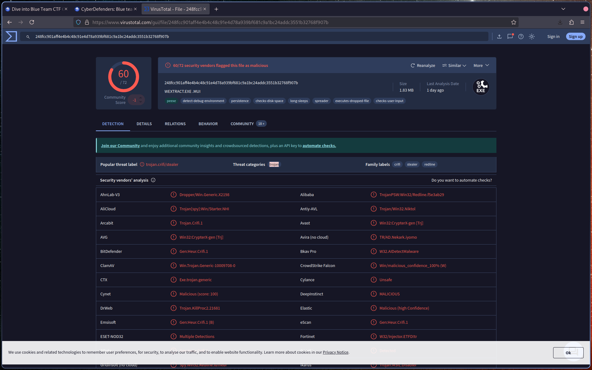
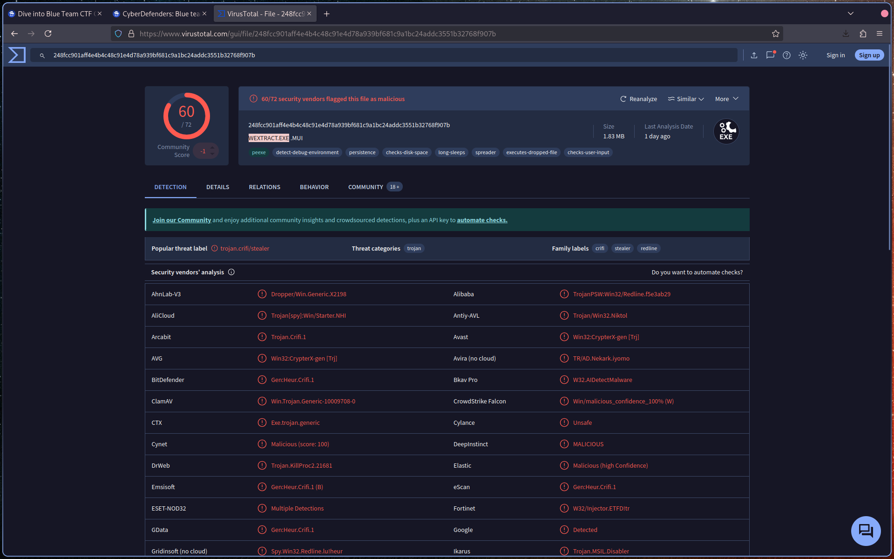
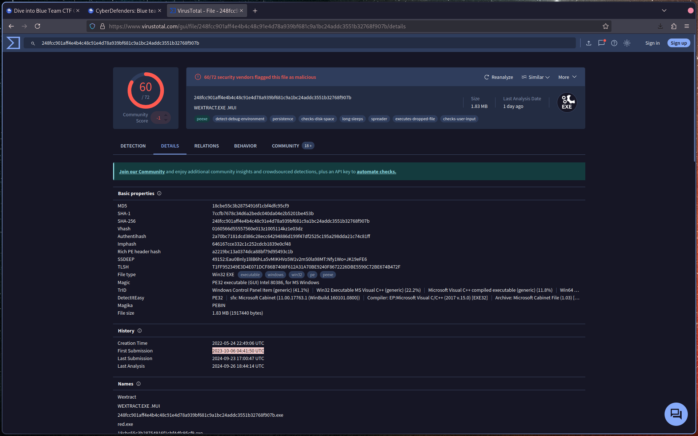
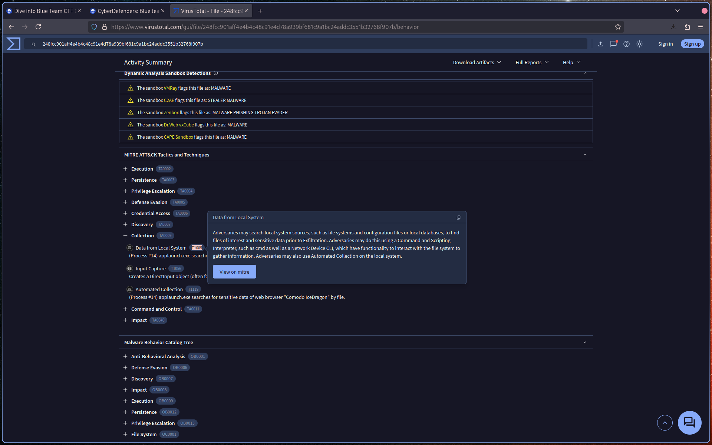
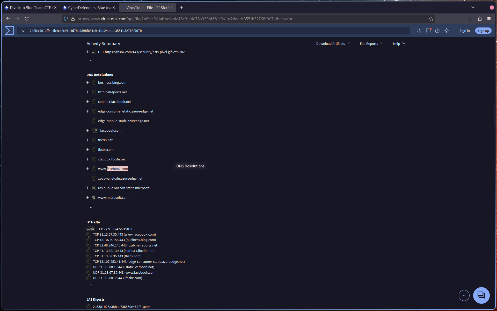
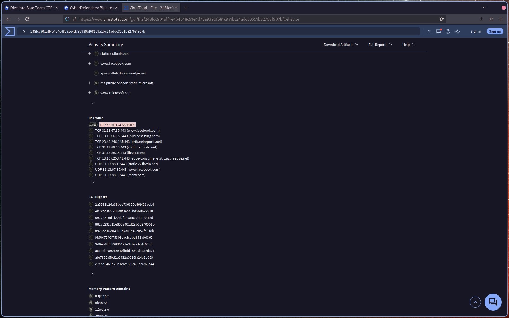
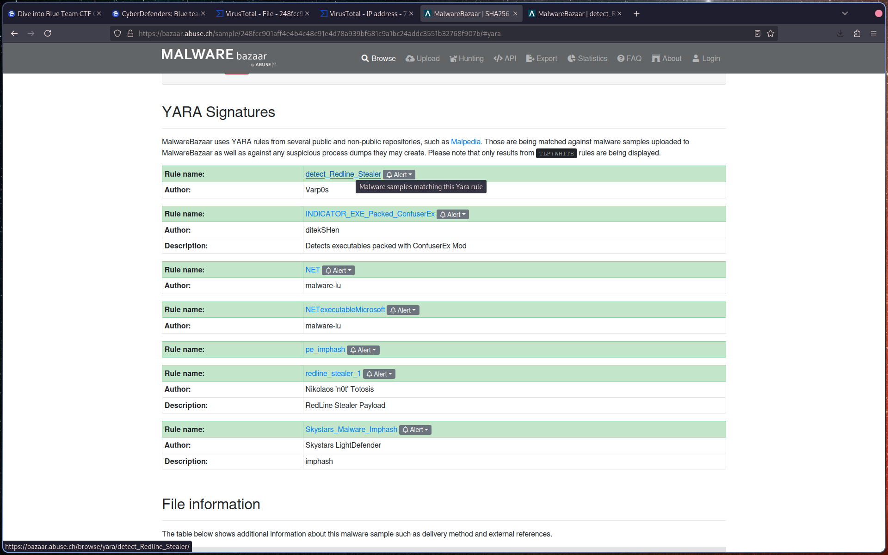
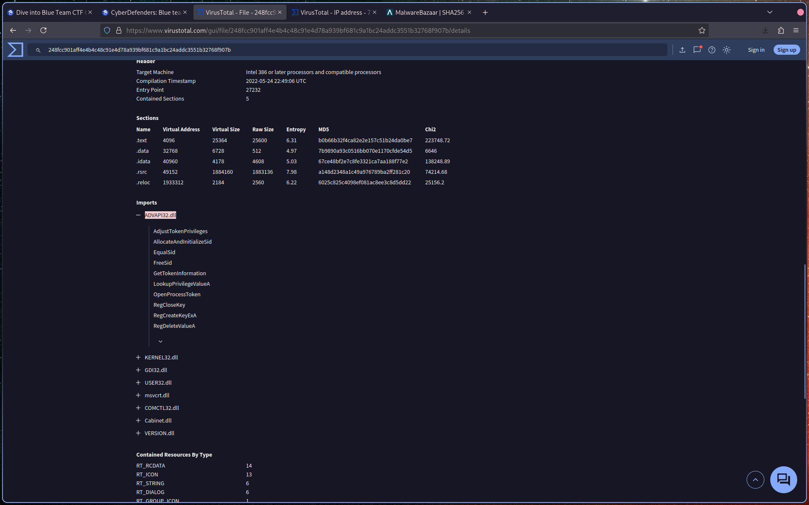

# Introduction

Tools recommended by the author (important for this analysis):

- Whois
- VirusTotal
- MalwareBazaar
- ThreatFox

---

# Q1: Categorizing malware allows for a quicker and easier understanding of the malware, aiding in understanding its distinct behaviors and attack vectors. What's the identified malware's category?

Submit the file hash to **VirusTotal** and review the main summary page.

Identify the malware **category** based on detection labels and classification.

---

# Q2: Clear identification of the malware file name facilitates better communication among the SOC team. What's the file name associated with this malware?

On the **VirusTotal** main/detection page, locate the file details.

Identify the **file name** associated with the malware.

---

# Q3: Knowing the exact time the malware was first seen can help prioritize actions. If the malware is newly detected, it may warrant more urgent containment and eradication efforts compared to older, well-known threats. Can you provide the UTC timestamp of first submission of this malware on VirusTotal?

Navigate to the **Detection** tab in **VirusTotal**.

Locate the **first submission timestamp** and ensure it is in **UTC** format.

---

# Q4: Understanding the techniques used by malware helps in strategic security planning. What is the MITRE ATT&CK technique ID for the malware's data collection from the system before exfiltration?

In **VirusTotal**, go to the **MITRE ATT&CK** section.

Navigate to:

> **Collection → Data from Local System**

Identify the corresponding **technique ID**.

---

# Q5: Following execution, what domain name resolution is performed by the malware?

In **VirusTotal**, review the **DNS Resolutions** section.

Identify the domain(s) queried by the malware.

---

# Q6: Once the malicious IP addresses are identified, network security devices such as firewalls can be configured to block traffic to and from these addresses. Can you provide the IP address and destination port the malware communicates with?

In **VirusTotal**, check the **IP Traffic** section.

Identify:

- The **malicious IP address**
- The **destination port**

---

# Q7: YARA rules are designed to identify specific malware patterns and behaviors. What's the name of the YARA rule created by "Varp0s" that detects the identified malware?

Search for the sample on **MalwareBazaar** using:

> `sha256:<hash>`

Navigate to the **YARA** section.

Identify the YARA rule authored by **Varp0s**.

---

# Q8: Understanding which malware families are targeting the organization helps in strategic security planning for the future and prioritizing resources based on the threat. Can you provide the different malware alias associated with the malicious IP address?

Use **ThreatFox** and search with:

> `ioc:<IP>`

Identify the different **malware aliases** associated with the IP address.

---

# Q9: By identifying the malware's imported DLLs, we can configure security tools to monitor for the loading or unusual usage of these specific DLLs. Can you provide the DLL utilized by the malware for privilege escalation?

Return to **VirusTotal** and review the **Imports** section.

Identify the DLL associated with privilege escalation functions such as:

- `AdjustTokenPrivileges`
- `GetTokenInformation`
- `LookupPrivilegeValueA`
