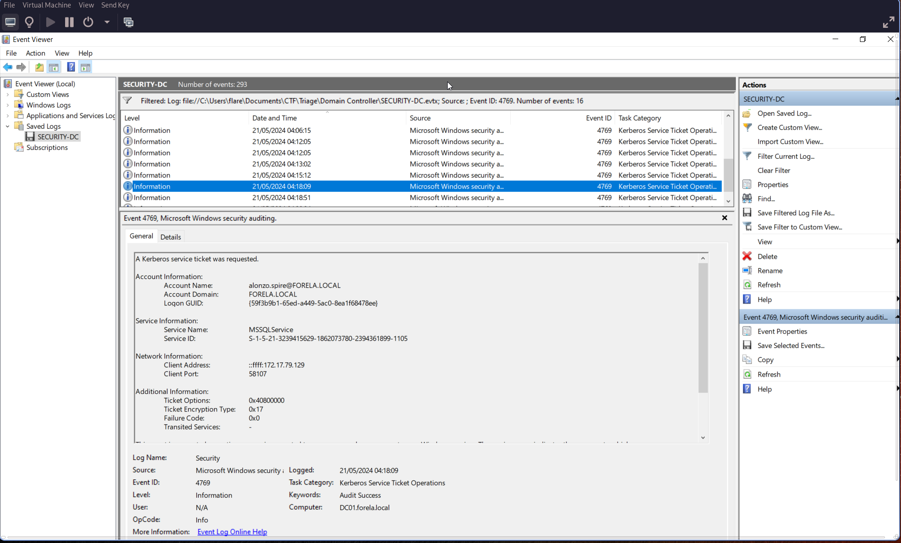
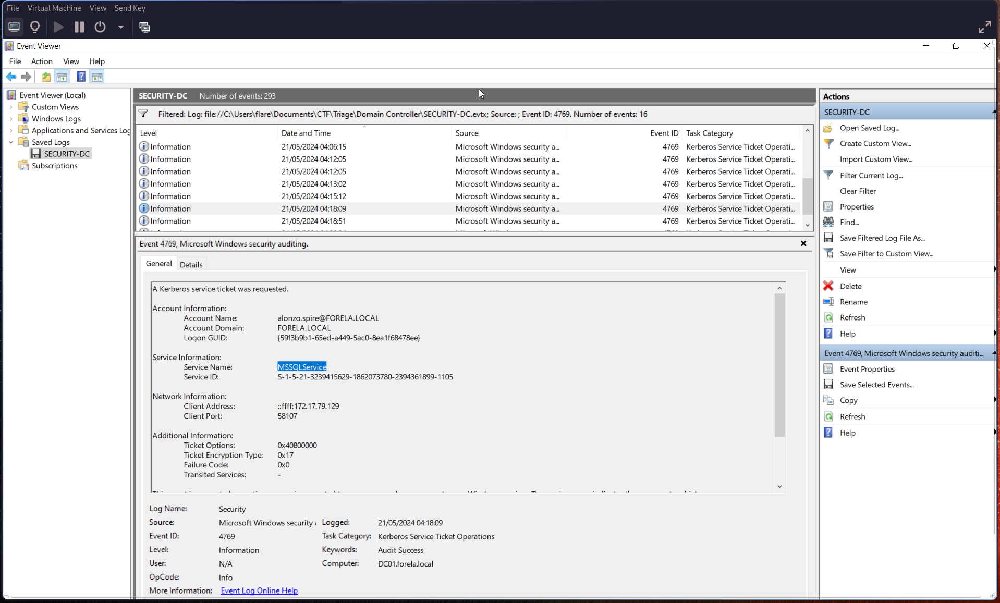
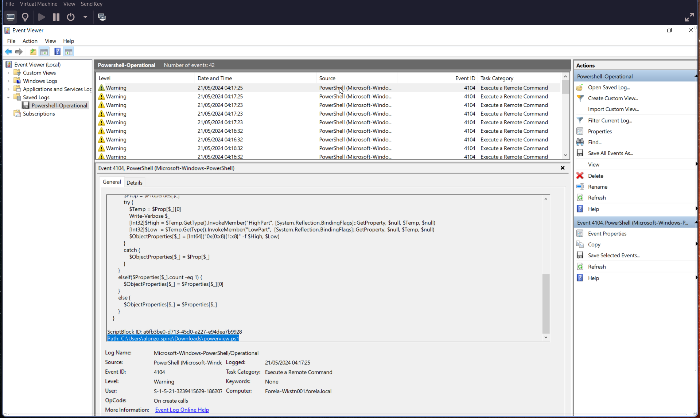
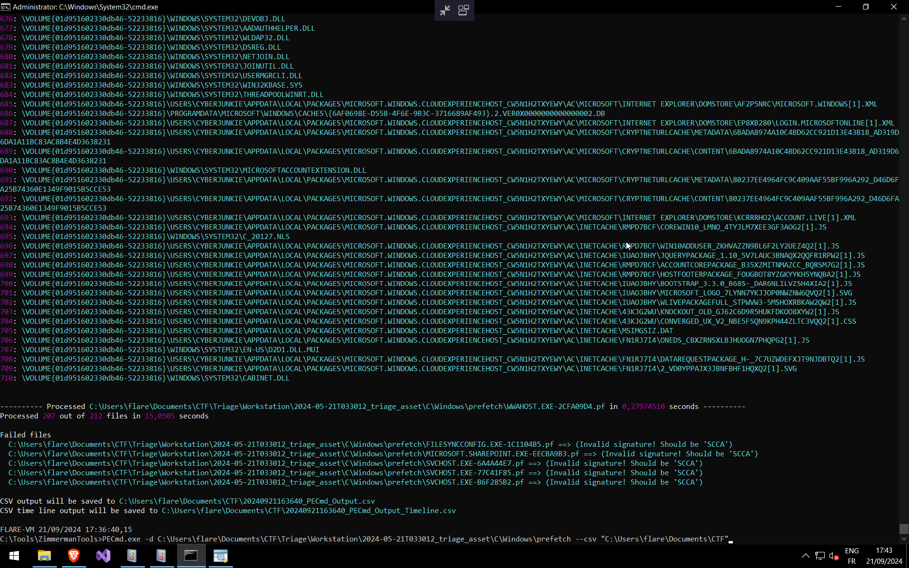
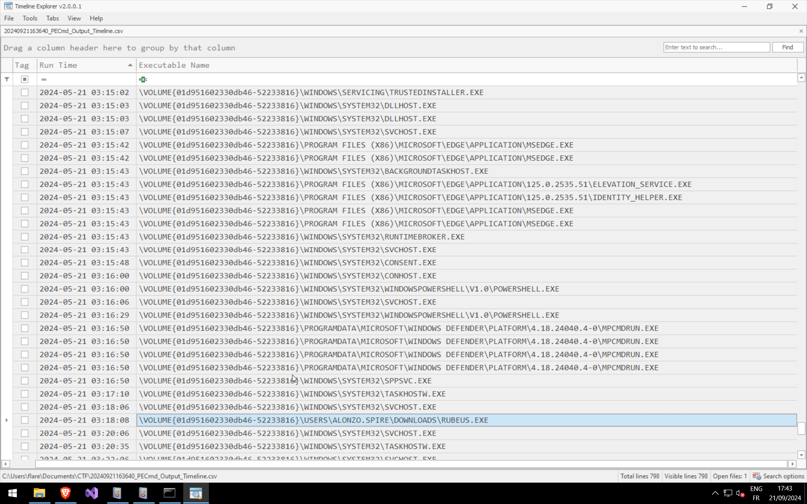

# Q1: Analyzing Domain Controller Security Logs

Can you confirm the **date and time** when the *Kerberoasting* activity occurred?

Open **Event Viewer** on the Windows VM and search for **Event ID [4769](https://learn.microsoft.com/en-us/previous-versions/windows/it-pro/windows-10/security/threat-protection/auditing/event-4769)**.
> 🕒 Remember to convert your local time to **UTC**.

---

# Q2: Targeted Service Name

What is the **Service Name** that was targeted?

Check the "Service Information" section of the same event:

---

# Q3: Workstation Identification

Identify the **Workstation IP Address** from which the activity originated.

In the same event, look under **Network Information → Client Address**:

> **Client Address:** `172.17.79.129`

---

# Q4: Script Enumeration for Kerberoastable Accounts

Now that we have the workstation, review the provided **PowerShell logs** and **Prefetch files** to understand how this activity occurred.
We’re looking for the file used to enumerate Active Directory objects and find Kerberoastable accounts.

Search using **Event ID [4104](https://learn.microsoft.com/en-us/powershell/module/microsoft.powershell.core/about/about_logging_windows?view=powershell-7.4)**.

---

# Q5: Script Execution Time

When was this script executed?

Refer again to **Event ID 4104**, and convert the timestamp to UTC.

> 🕒 **Execution Time (UTC):** `2024-05-21 03:16:32`

---

# Q6: Kerberoasting Tool Path

Determine the full path of the tool used to perform the actual *Kerberoasting* attack.

Use **[PECmd](https://github.com/EricZimmerman/PECmd)** for Prefetch analysis.

Then, open the exported timeline `.csv` using **[Timeline Explorer](https://github.com/EricZimmerman)**.

---

# Q7: Tool Execution Time

When was the tool executed to dump credentials?

You can find this information in the previous screenshot (Prefetch timeline CSV output).

---
