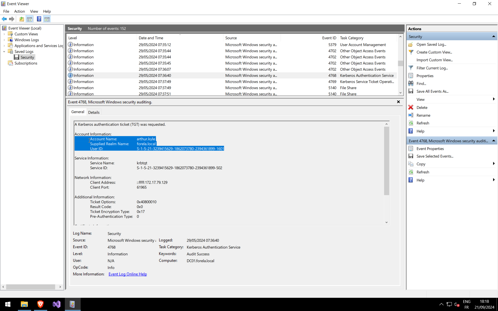
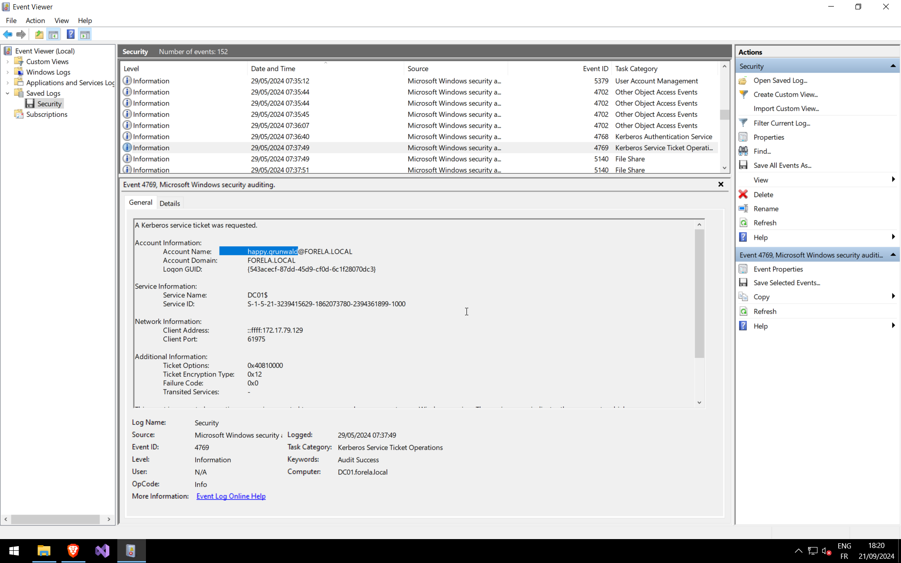

# Q1: When did the *AS-REP Roasting* attack occur, and when did the attacker request the Kerberos ticket for the vulnerable user?

Open **Event Viewer** on the Windows VM and search for **Event ID [4768](https://learn.microsoft.com/en-us/previous-versions/windows/it-pro/windows-10/security/threat-protection/auditing/event-4768)**.

Look for anomalies in the logs — specifically events where:

> **Pre-Authentication Type:** `0`

This indicates that the account does not require Kerberos pre-authentication, making it vulnerable to *AS-REP Roasting*.

> 🕒 Remember to convert the timestamp to **UTC** when documenting your findings.

---

# Q2: Please confirm the **User Account** that was targeted by the attacker.

Within the same **Event ID 4768**, navigate to:

> **Account Information → Account Name**

This field identifies the vulnerable account targeted during the attack.

---

# Q3: What was the **SID** of the targeted account?

Again, in the same event:

> **Account Information → User ID**

This value provides the unique **Security Identifier (SID)** of the compromised account.

---

# Q4: Identify the **internal IP address** of the compromised workstation used in this attack.

In the same event, check:

> **Network Information → Client Address**

This reveals the source system that initiated the AS-REP request.

---

# Q5: Using the same Domain Controller security logs, determine which **user account performed the AS-REP Roasting attack**.

Search for **Event ID [4769](https://learn.microsoft.com/en-us/previous-versions/windows/it-pro/windows-10/security/threat-protection/auditing/event-4769)**, which logs Kerberos service ticket requests.

Correlate this event with the earlier **4768** event to identify the attacker-controlled account.

> 🔍 The **Account Name** in this event indicates the user account used to request service tickets after identifying the vulnerable account.

---
