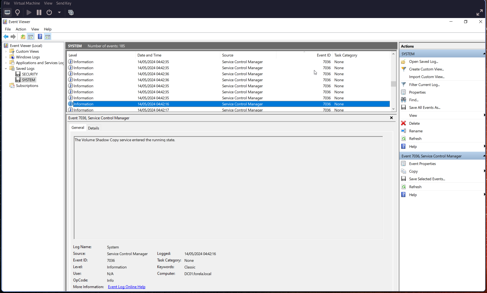
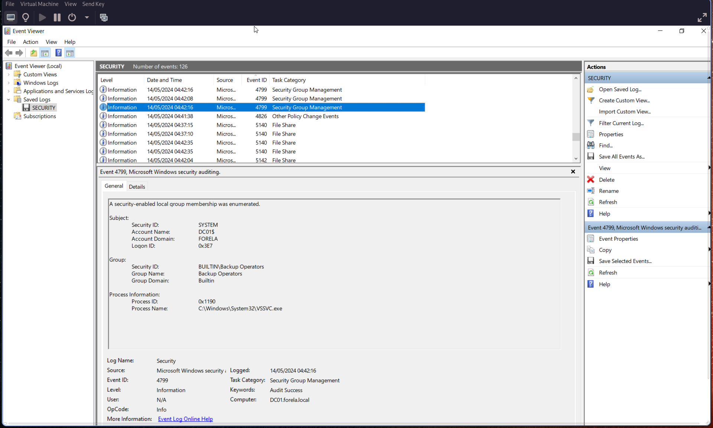
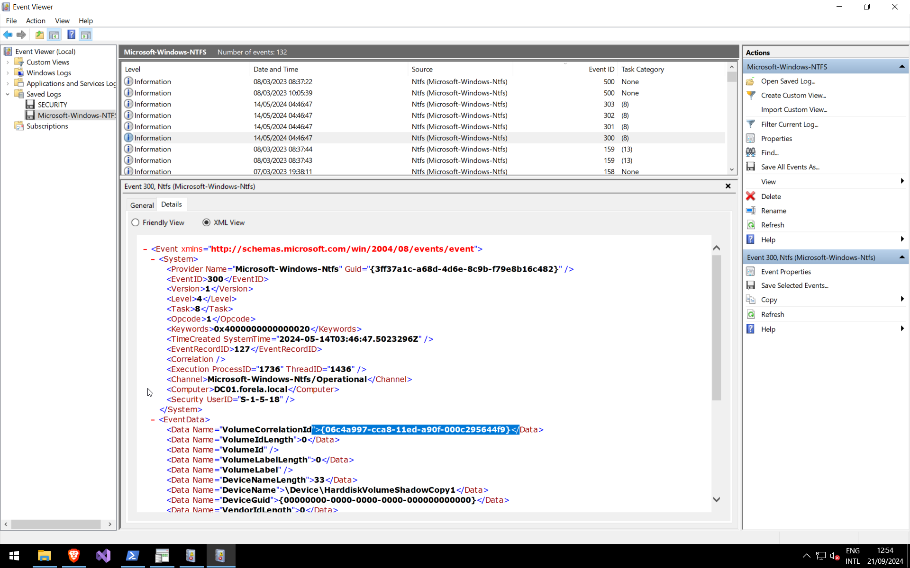
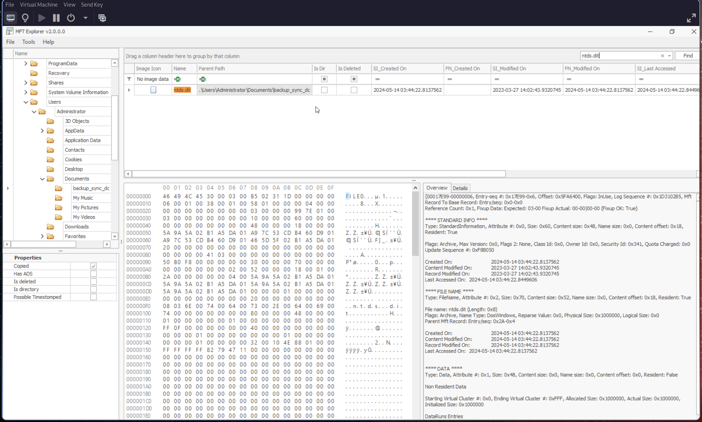
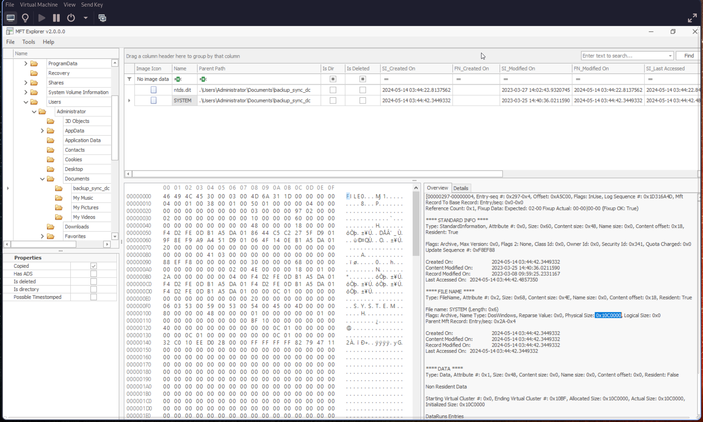

# Q1: Attackers can abuse the vssadmin utility to create volume shadow snapshots and then extract sensitive files like NTDS.dit to bypass security mechanisms. Identify the time when the Volume Shadow Copy service entered a running state.

Open the **SYSTEM.evtx** log and search for **Event ID 7036**.

Look for events indicating the **Volume Shadow Copy** service entering a running state:

> 🕒 Convert the timestamp to **UTC**.

---

# Q2: When a volume shadow snapshot is created, the Volume shadow copy service validates the privileges using the Machine account and enumerates User groups. Find the User groups it enumerates, the Subject Account name, and also identify the Process ID(in decimal) of the Volume shadow copy service process

Search for **Event ID [4799](https://learn.microsoft.com/en-us/previous-versions/windows/it-pro/windows-10/security/threat-protection/auditing/event-4799)** and filter for:

> **Process Name:** `VSSVC.exe`

From this event, identify:

- **User Groups**
- **Subject Account Name**
- **Process ID** (convert to decimal if needed)

---

# Q3: Identify the Process ID (in Decimal) of the volume shadow copy service process.

From the previous **Event ID 4799**:

> **Process ID:** (convert from hexadecimal to decimal)

Example:
> `0x1190` → *(convert to decimal)*

---

# Q4: Find the assigned Volume ID/GUID value to the Shadow copy snapshot when it was mounted.

Search for **Event ID 300** in **NTFS logs**:

---

# Q5: Identify the full path of the dumped NTDS database on disk.

Use a forensic tool such as **Autopsy** and search for:

> `ntds.dit`

---

# Q6: When was newly dumped ntds.dit created on disk?

From the previous result in **Autopsy**, check:

> **Created On** field

---

# Q7: A registry hive was also dumped alongside the NTDS database. Which registry hive was dumped and what is its file size in bytes?

Navigate to the same directory as **ntds.dit**.

You should find the **SYSTEM** hive. In **Autopsy**, check the **Overview** tab:

---
