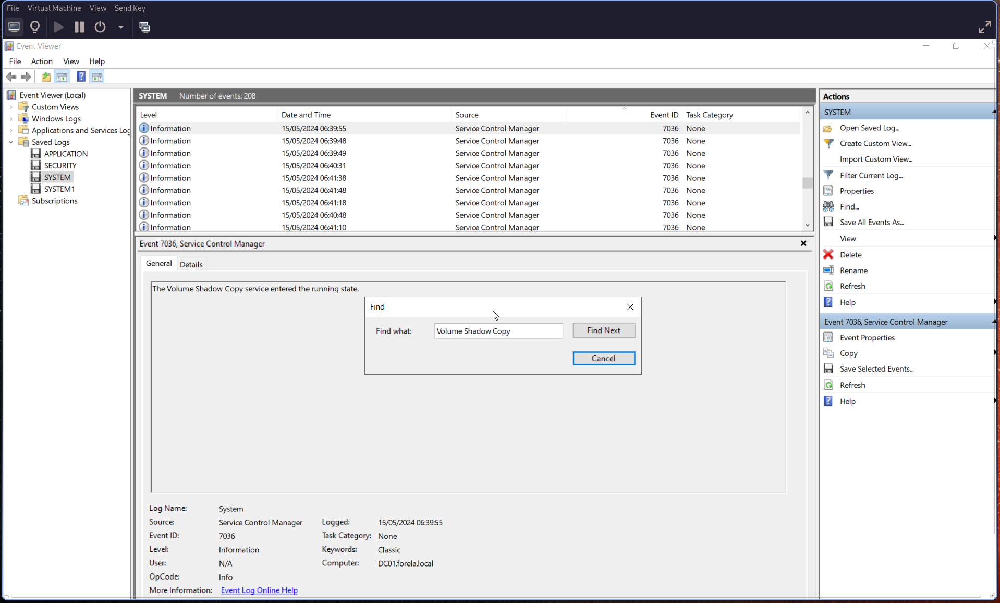
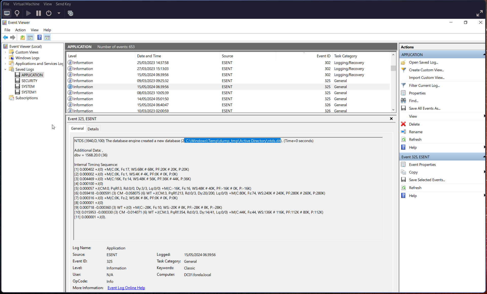
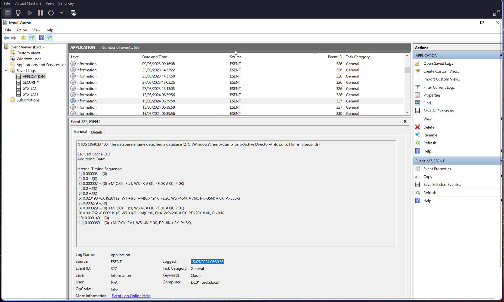
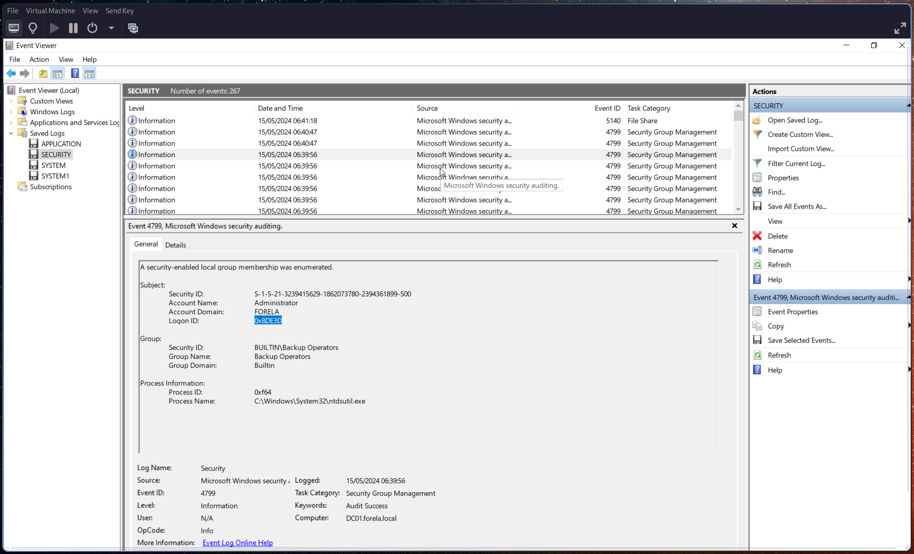
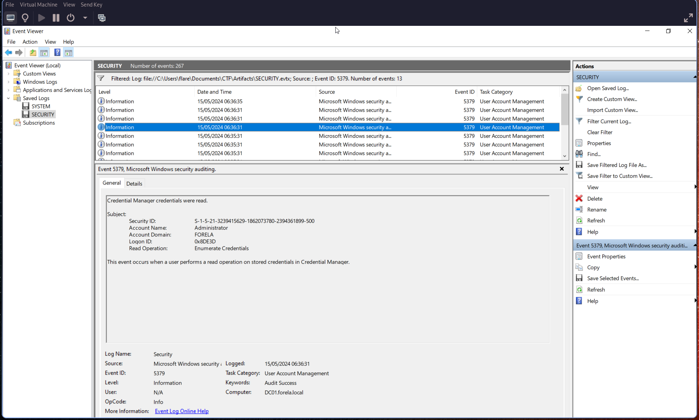

# Q1: When utilizing ntdsutil.exe to dump NTDS on disk, it simultaneously employs the Microsoft Shadow Copy Service. What is the most recent timestamp at which this service entered the running state, signifying the possible initiation of the NTDS dumping process?

Open the **SYSTEM.evtx** log and search for **Event ID 7036**.

Use a search (Ctrl+F) for **Volume Shadow Copy** service events.

Identify the most recent entry where the service entered the running state and note the timestamp from the:

> **Logged** field

> 🕒 Convert the timestamp to **UTC**.

---

# Q2: Identify the full path of the dumped NTDS file.

Search for **ESENT-related events**, which are tied to database operations.

Use **Event ID 325**, which indicates:

> *"The database engine created a new database"*

This event includes the full file path of the dumped database.

---

# Q3: When was the database dump created on the disk?

From the same **Event ID 325**, retrieve the timestamp from the:

> **Logged** field

This indicates when the database dump was created.

---

# Q4: When was the newly dumped database considered complete and ready for use?

Search for **Event ID 327**, which indicates:

> *"The database engine detached a database"*

This marks when the dump process completed and the database was ready for use.

---

# Q5: Event logs use event sources to track events coming from different sources. Which event source provides database status data like creation and detachment?

Check the **Source** field in the relevant events.

> **Event Source:** `ESENT`

This source is responsible for logging database creation, usage, and detachment events.

---

# Q6: When ntdsutil.exe is used to dump the database, it enumerates certain user groups to validate the privileges of the account being used. Which two groups are enumerated by the ntdsutil.exe process? Also, find the Logon ID so we can easily track the malicious session in our hunt.

Search for **Event ID [4799](https://learn.microsoft.com/en-us/previous-versions/windows/it-pro/windows-10/security/threat-protection/auditing/event-4799)** and filter for:

> **Process Name:** `ntdsutil.exe`

From this event, identify:

- The **two enumerated user groups**
- The **Logon ID**

---

# Q7: Now you are tasked to find the Login Time for the malicious Session. Using the Logon ID, find the Time when the user logon session started.

Search for **Event ID [5379](https://www.ultimatewindowssecurity.com/securitylog/encyclopedia/event.aspx?eventid=5379)**.

Using the **Logon ID** identified in the previous step, correlate the event and extract the timestamp from the:

> **Logged** field

This represents the start time of the malicious logon session.

---
