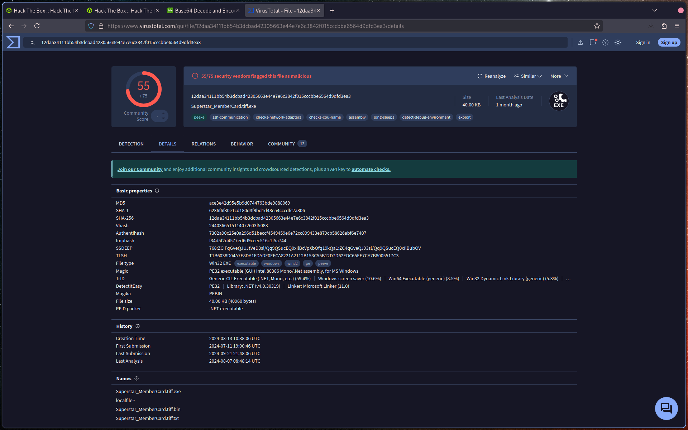
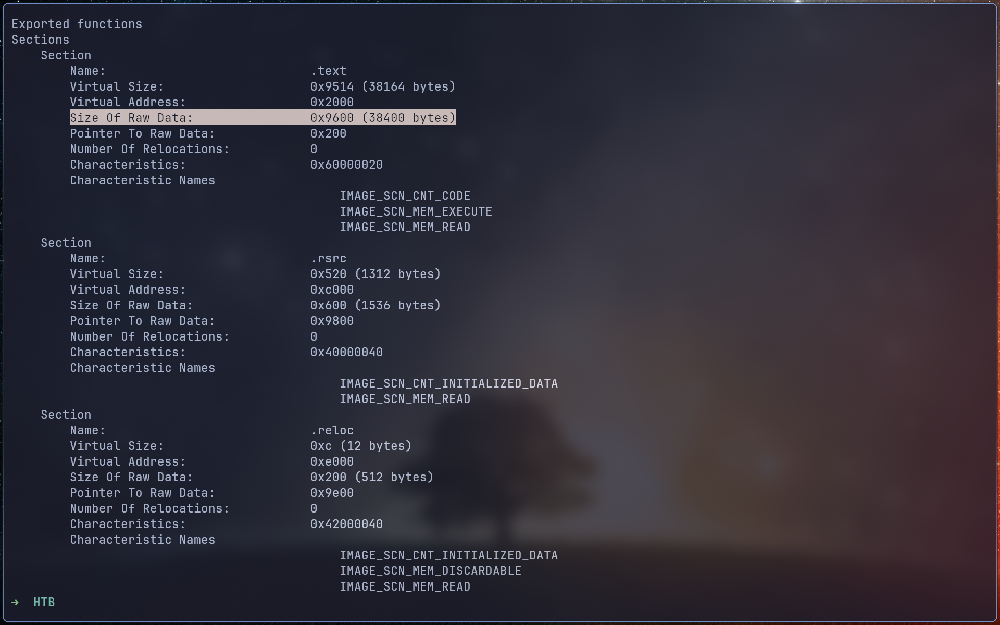
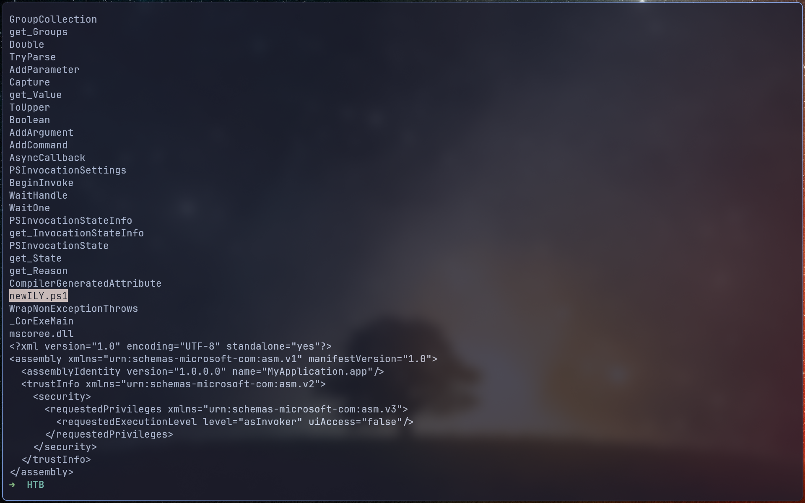
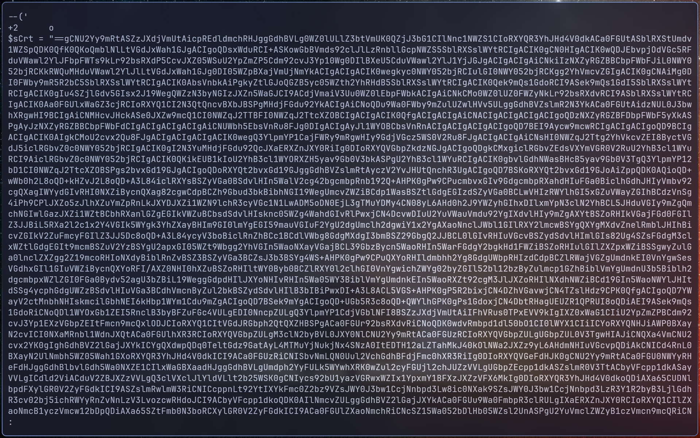
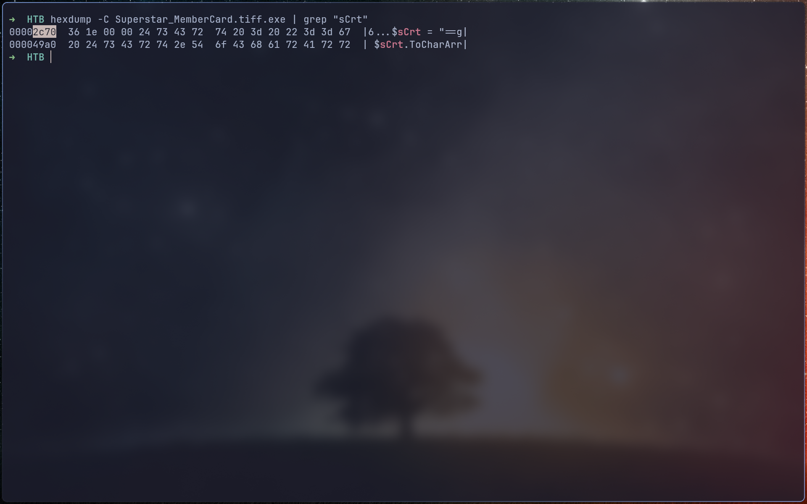
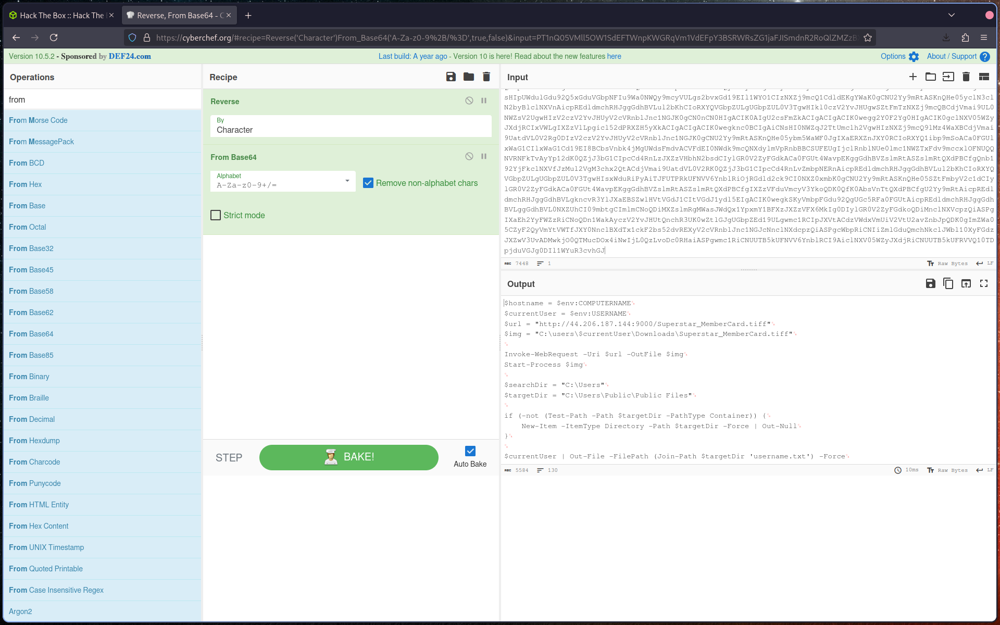
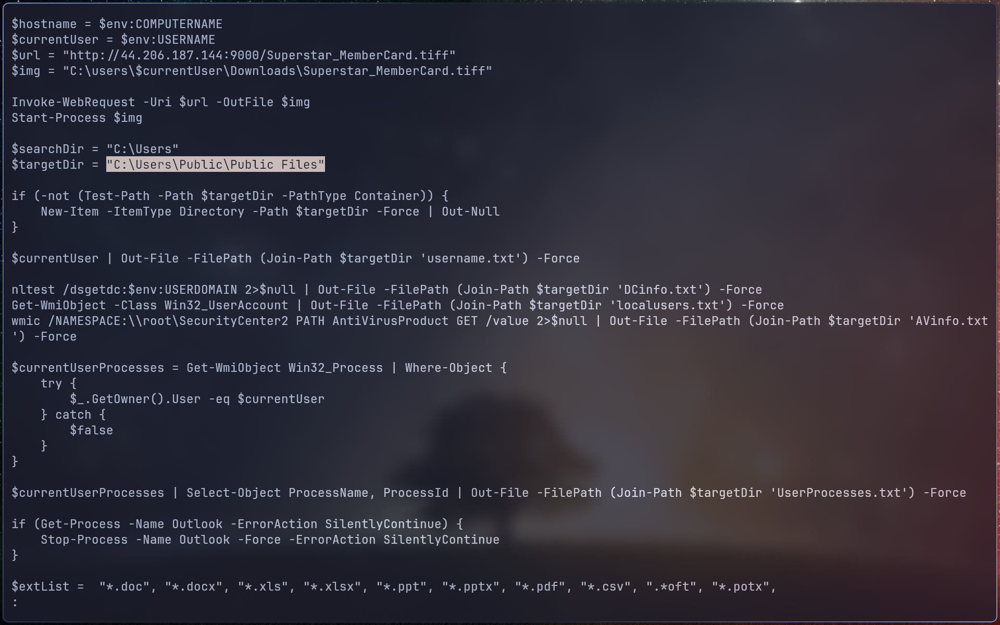
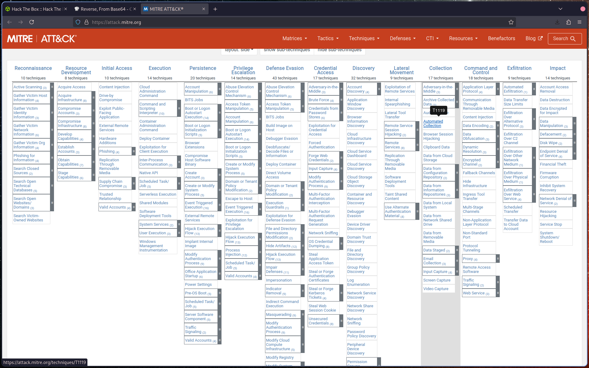
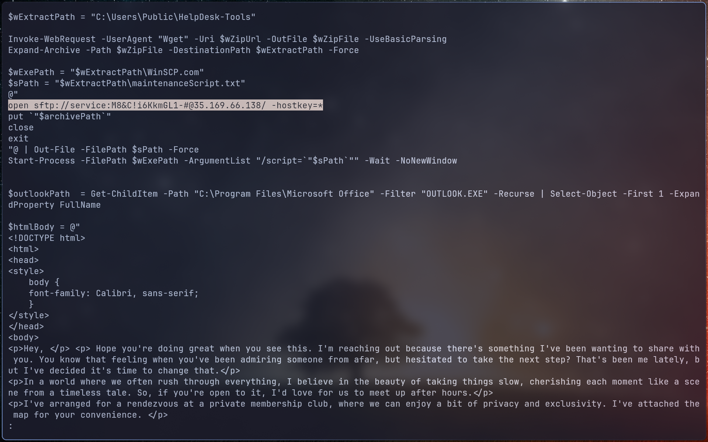

# Q1: To accurately reference and identify the suspicious binary, please provide its SHA256 hash.

Identify the SHA256 hash of the suspicious binary file.

> **File Name:** `Superstar_MemberCard.tiff.exe`
> **SHA256:** `12daa34111bb54b3dcbad42305663e44e7e6c3842f015cccbbe6564d9dfd3ea3`

---

# Q2: When was the binary file originally created, according to its metadata (UTC)?

Upload the file hash to **VirusTotal** to retrieve metadata information.

Locate the **first seen / creation timestamp** and convert it to **UTC**.

---

# Q3: Examining the code size in a binary file can give indications about its functionality. Could you specify the byte size of the code in this binary?

Use a tool such as **readpe** to inspect the binary structure.

This will provide details about the **code section size** within the executable.

---

# Q4: It appears that the binary may have undergone a file conversion process. Could you determine its original filename?

Use the **strings** utility to extract readable content from the binary.

Search for references to script or executable names.

You should identify the original filename:

> `newILY.ps1`

---

# Q5: Specify the hexadecimal offset where the obfuscated code of the identified original file begins in the binary.

Locate the obfuscated content within the binary.

Then use **hexdump** to determine the exact **hexadecimal offset** where this content begins.

---

# Q6: The threat actor concealed the plaintext script within the binary. Can you provide the encoding method used for this obfuscation?

From the extracted content, identify the encoding method used.

> The encoding method is **Base64**

---

# Q7: What is the specific cmdlet utilized that was used to initiate file downloads?

Decode the embedded script and analyze its contents.

Identify the PowerShell cmdlet used to download files:

> `Invoke-WebRequest`

---

# Q8: Could you identify any possible network-related Indicators of Compromise (IoCs) after examining the code? Separate IPs by comma and in ascending order.

Inspect the decoded script for network indicators.

You should find **IP addresses** embedded in the payload (e.g., in specific lines of the script).

List them in ascending order, separated by commas.

---

# Q9: The binary created a staging directory. Can you specify the location of this directory where the harvested files are stored?

In the decoded script, locate the variable defining the staging directory:

> `$targetDir`

This value specifies where collected files are stored.

---

# Q10: What MITRE ID corresponds to the technique used by the malicious binary to autonomously gather data?

Refer to the **MITRE ATT&CK** framework.

Navigate to:

> **Collection → Automated Collection**

Identify the corresponding **MITRE Technique ID**.

---

# Q11: What is the password utilized to exfiltrate the collected files through the file transfer program within the binary?

Analyze the decoded script further.

Locate the section where file transfer (e.g., SFTP) is configured.

The **password** used for exfiltration is defined alongside the connection details (e.g., near the second IP address).

---
