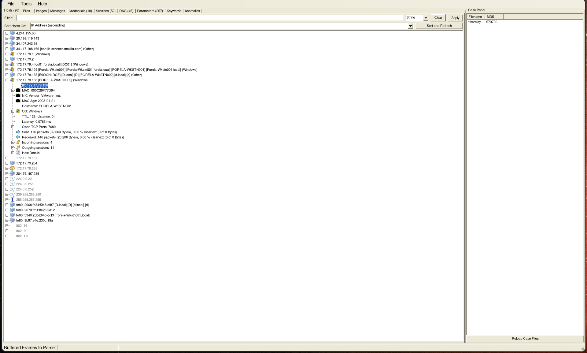
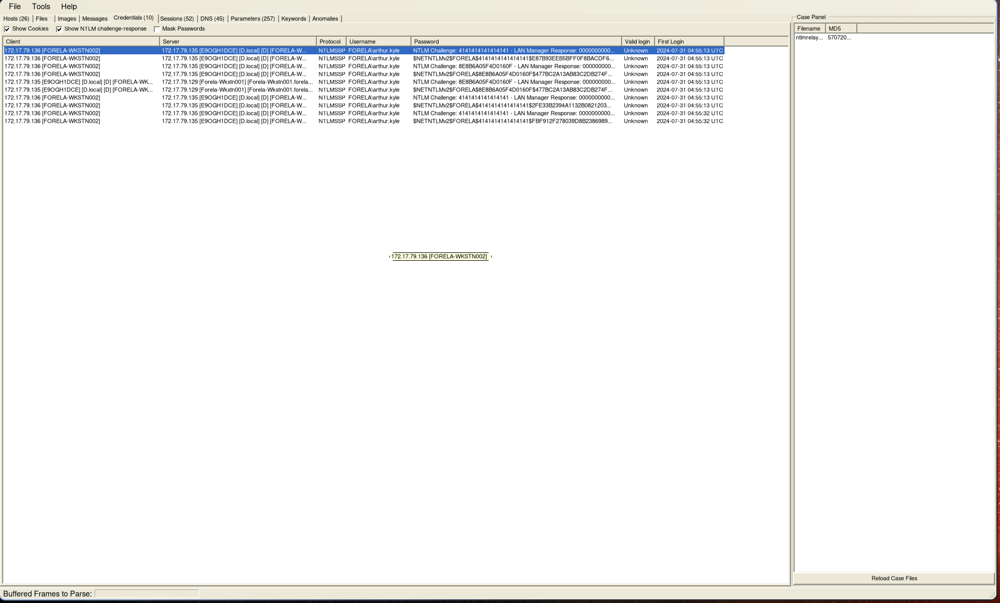
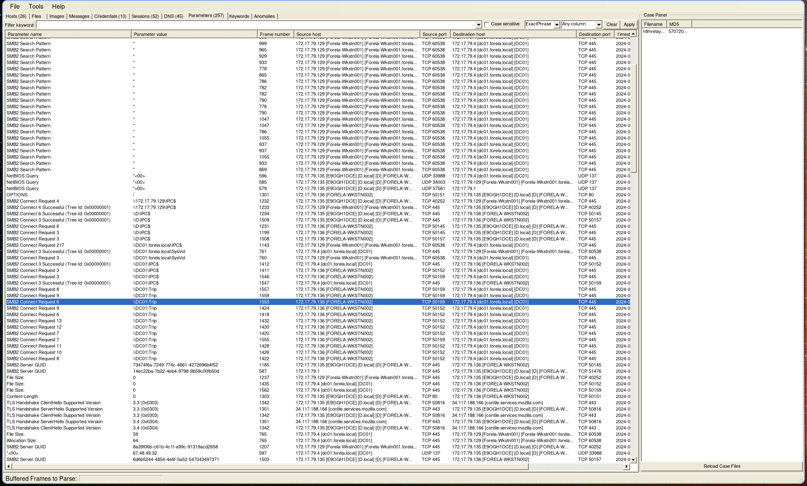
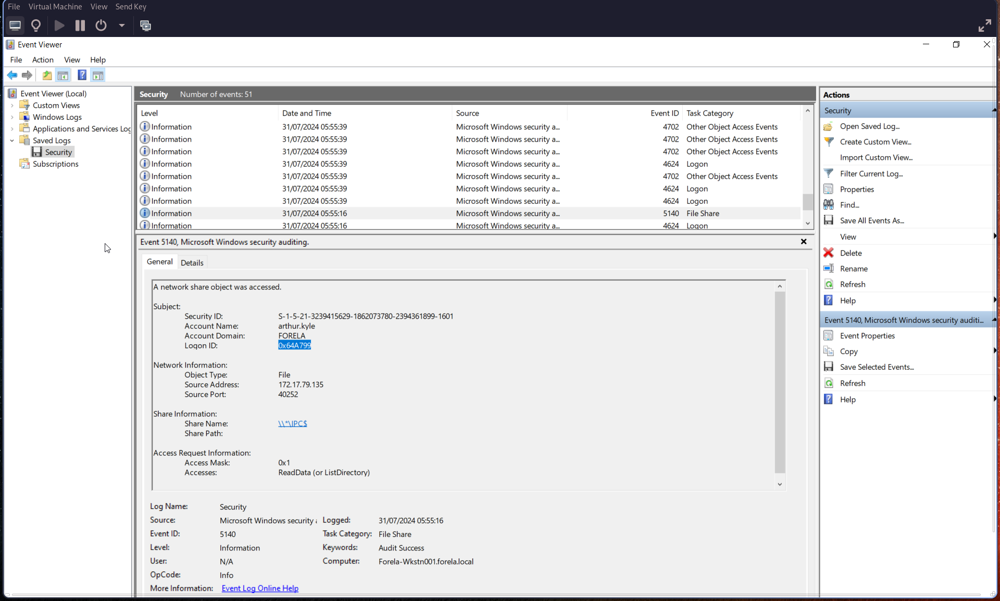
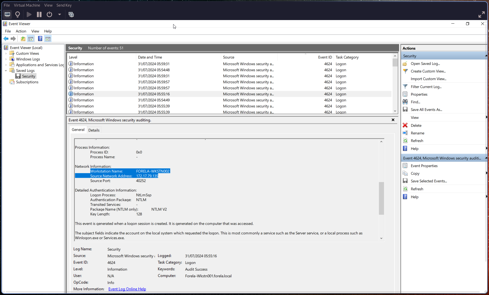

# Q1: IP Address of Forela-Wkstn001

What is the IP address of **Forela-Wkstn001**?

> 🔎 See Q2 for the analysis steps.

---

# Q2: IP Address of Forela-Wkstn002

What is the IP address of **Forela-Wkstn002**?

**Note:** NetworkMiner requires `.pcap` format. Convert the file if needed:

```bash
tshark -F pcap -r ntlmrelay.pcapng -w ntlmrelay.pcap
```

Open the capture in **NetworkMiner** to get an overview of network activity.
Both workstation IP addresses can be identified here:



---

# Q3: Compromised User Account

Which **user account hash** was stolen by the attacker?

> 🔎 See Q4 for details.

---

# Q4: Attacker Device IP Address

What is the IP address of the **unknown device** used by the attacker to intercept credentials?

Navigate to the **Credentials** tab in NetworkMiner to identify:

- The compromised user account
- The attacker’s IP address



---

# Q5: Accessed Fileshare

What fileshare was accessed by the victim user account?

Switch to the **Parameters** tab and filter for `SMB2` requests.
Only one directory was accessed:



---

# Q6: Source Port Used

What is the **source port** used to log on to the target workstation using the compromised account?

> 🔎 See Q7 for details.

---

# Q7: Malicious Session Logon ID

What is the **Logon ID** for the malicious session?

Open `security.evtx` and inspect **Event ID [5140](https://learn.microsoft.com/en-us/previous-versions/windows/it-pro/windows-10/security/threat-protection/auditing/event-5140)** (network share object).

From this event:

- Extract the **Logon ID** (in hexadecimal)
- Identify the **source port** (used for Q6)



---

# Q8: Suspicious Logon Details

The detection is based on a mismatch between hostname and assigned IP address.
What are:

- The workstation name?
- The source IP address used during the malicious logon?

> 🔎 See Q9 for details.

---

# Q9: Malicious Logon Timestamp

When did the malicious logon occur? Ensure the timestamp is in **UTC**.

Check **Event ID [4624](https://learn.microsoft.com/en-us/previous-versions/windows/it-pro/windows-10/security/threat-protection/auditing/event-4624)** (logon event).

Key indicators:

- Logon ID `0x0`
- Security ID `NULL`
- Associated user: `arthur kyle`

This event provides:

- Timestamp (convert to UTC)
- Workstation name
- Source IP address



---

# Q10: Accessed Share Name

What is the **share name** accessed during authentication by the malicious tool?

Refer back to **Event ID 5140** (see Q6/Q7) to identify the share name.

---
